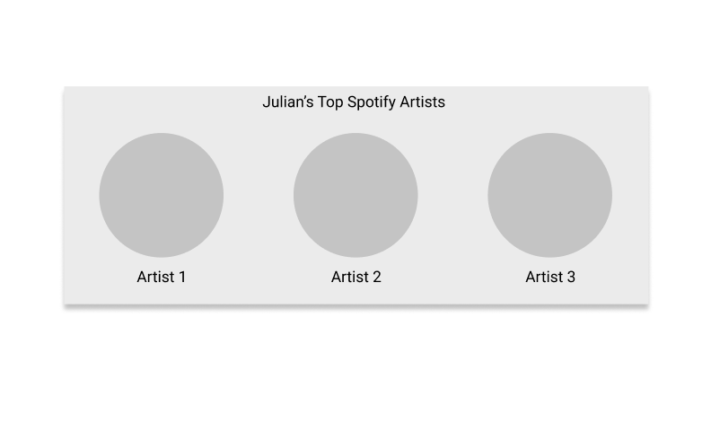

I'm going to build a "Spotify Top Artists" web component using Svelte.js, and document the process here.

Svelte is a framework for building web applications out of many individual components. It is a declarative, component-based approach to building UI. However, you can also use it to output a single custom element, aka web component, which could then be used anywhere (framework agnostic).

Motivations:

- A nice lil project to keep me busy in the evenings
- I like music and Spotify
- I like Svelte
- I'd like to use the component on this site (because why not)

Goals:

A simple, standalone component, that interacts with the Spotify API to fetch the given users top artists (all time).

Mockup


I'm not a designer, and I'd imagine the final thing is going to look different. But good to get started with at least an idea.

To follow along you'll need familiarty with JavaScript, Svelte.js, and the Spotify API. I'll be using VS Code, but you can use whichever editor you prefer.

Lets get started. Run the following commands from your terminal:

```
npm init svelte@next spotify-top-artists
cd spotify-top-artists
npm install
npm run dev -- --open

```

This will do a few things.

- scafold a sveltkit project in a new directory `spotify-top-artists`
- install dependencies
- run the development server at http://localhost:3000
